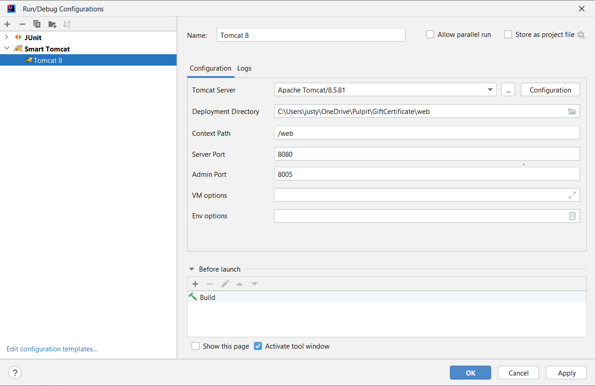

# GiftCertificate

---

GiftCertificate Application is a part of a training project described in [here.](https://github.com/mjc-school/MJC-School/blob/old/stage%20%233/java/module%20%232.%20REST%20API%20Basics/rest_api_basics_task.md)

Application is designed to manage a database of gift certificates. Every gift certificate can be described with multiple tags. 

## 1. Functionalities

### 1.1. Searching gift certificates: 
+ find all  
  http://localhost:8080/web/gift_certificates
+ find by **key** word in name or description
  http://localhost:8080/web/gift_certificates/key/key
+ find by **id**  
  http://localhost:8080/web/gift_certificates/id
+ find by **tag**  
  http://localhost:8080/web/gift_certificates/tag/tag

### 1.2. Sorting gift certificates:
+ sort ascending by name  
  http://localhost:8080/web/gift_certificates/asc
+ sort descending by name  
  http://localhost:8080/web/gift_certificates/desc
+ sort ascending by date  
http://localhost:8080/web/gift_certificates/asc/date
+ sort descending by date  
  http://localhost:8080/web/gift_certificates/desc/date

### 1.3. Adding gift certificate with tag 
+ http://localhost:8080/web/gift_certificates

### 1.4. Updating gift certificate 
+ http://localhost:8080/web/gift_certificates

### 1.5. Deleting gift certificate 
+ http://localhost:8080/web/gift_certificates/id

### 1.6. Searching tags
+ find all   
  http://localhost:8080/web/tags
+ find by **id**   
  http://localhost:8080/web/tags/id
+ find by **name**  
  http://localhost:8080/web/tags/name/name

### 1.7. Adding tag
+ http://localhost:8080/web/tags/

### 1.8. Deleting tag
+ http://localhost:8080/web/tags/18

## 2. Technology stack

***

GiftCertificate uses following technologies:
1. JDK v.1.8.0_311
2. Maven v.3.8.4
3. Spring Framework v.5.3.21
4. Hikari Connection Pool v.4.0.3
5. Apache Tomcat v.9.0.65
6. PostgreSQL JDBC v.42.3.6 and H2 v.2.1.214
7. JUnit v.5.9.0-M1, AssertJ v.3.23.1, Mockito v.4.6.1

## 3. Prerequisites

***

Using GiftCertificate requires:
1. Intellij IDEA v.2022.1
2. Smart Tomcat Plugin
3. PostgreSQL

## 4. Build and run application 
***

### 4.1. Build project
+ from terminal:
  `mvn clean install`
+ from Intellij IDEA:
  `Ctrl + F9`

### 4.2. Run tests
+ from terminal:
  `mvn verify`
+ from IntelliJ IDEA:
  `Ctrl + Shift + F10`

### 4.3. Run application - Run/Debug Configuration 

## 5. TODO List

***

### 5.1. Business requirements

- [x] Develop web service for Gift Certificates system with the following entities (many-to-many) 
  - [x] CreateDate, LastUpdateDate - format ISO 8601 (https://en.wikipedia.org/wiki/ISO_8601). Example: 2018-08-29T06:12:15.156. More discussion here: https://stackoverflow.com/questions/3914404/how-to-get-current-moment-in-iso-8601-format-with-date-hour-and-minute
  - [x] Duration - in days (expiration period)
- [x] The system should expose REST APIs to perform the following operations:
  - [x] CRUD operations for GiftCertificate. If new tags are passed during creation/modification – they should be created in the DB. For update operation - update only fields, that pass in request, others should not be updated. Batch insert is out of scope.
  - [x] CRD operations for Tag.
  - [x] Get certificates with tags (all params are optional and can be used in conjunction):
    - [x] by tag name (ONE tag)
    - [x] search by part of name/description (can be implemented, using DB function call)
    - [x] sort by date or by name ASC/DESC (extra task: implement ability to apply both sort type at the same time).

### 5.2. Application requirements

- [x] JDK version: 8 – use Streams, java.time.*, etc. where it is possible. (the JDK version can be increased in agreement with the mentor/group coordinator/run coordinator)
- [x] Application packages root: com.epam.esm
- [x] Any widely-used connection pool could be used.
- [x] JDBC / Spring JDBC Template should be used for data access.
- [x] Use transactions where it’s necessary.
- [x] Java Code Convention is mandatory (exception: margin size – 120 chars).
- [x] Build tool: Maven/Gradle, latest version. Multi-module project.
- [x] Web server: Apache Tomcat/Jetty.
- [x] Application container: Spring IoC. Spring Framework, the latest version.
- [x] Database: PostgreSQL/MySQL, latest version.
- [x] Testing: JUnit 5.+, Mockito.
- [x] Service layer should be covered with unit tests not less than 80%.
- [x] Repository layer should be tested using integration tests with an in-memory embedded database (all operations with certificates).

### 5.3. General requirements
- [x] Code should be clean and should not contain any “developer-purpose” constructions.
- [x] App should be designed and written with respect to OOD and SOLID principles.
- [x] Code should contain valuable comments where appropriate.
- [x] Public APIs should be documented (Javadoc).
- [x] Clear layered structure should be used with responsibilities of each application layer defined.
- [x] JSON should be used as a format of client-server communication messages.
- [x] Convenient error/exception handling mechanism should be implemented: all errors should be meaningful and localized on backend side.
- [x] Abstraction should be used everywhere to avoid code duplication.
- [x] Several configurations should be implemented (at least two - dev and prod).
